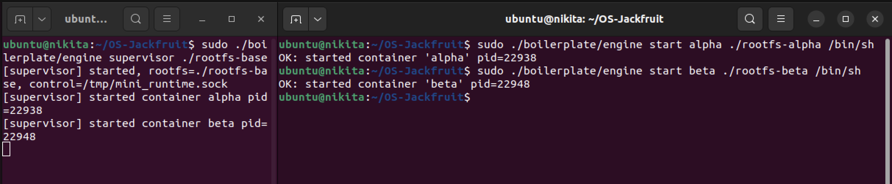
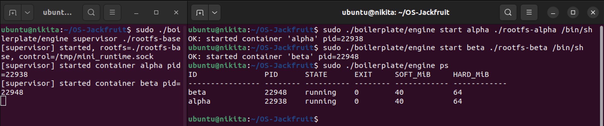
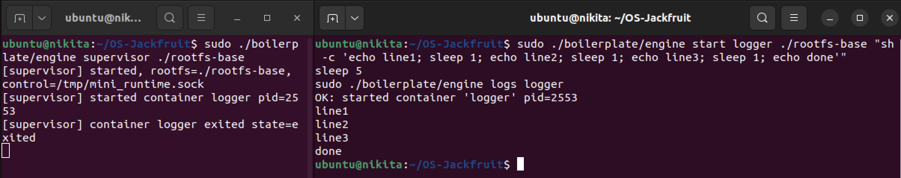
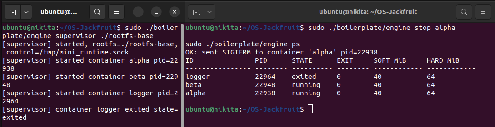
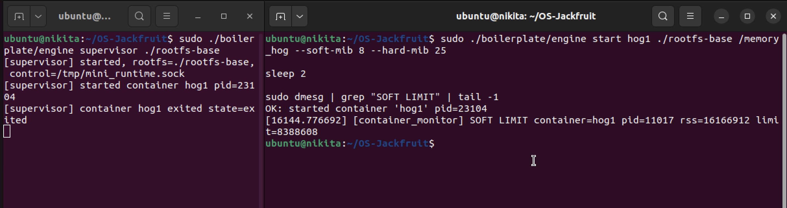
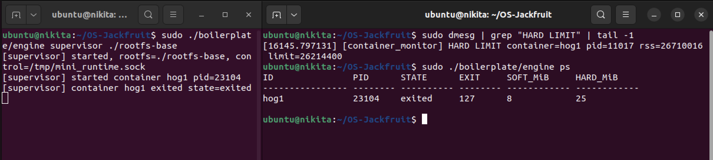
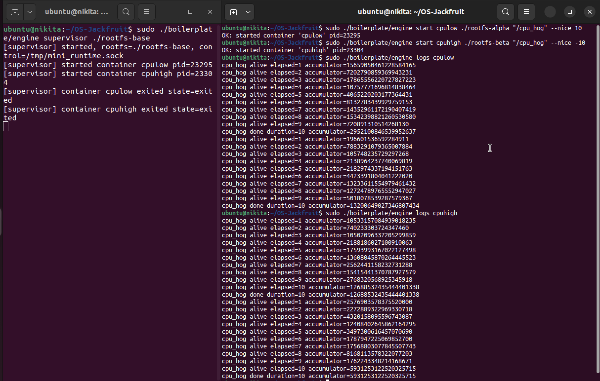
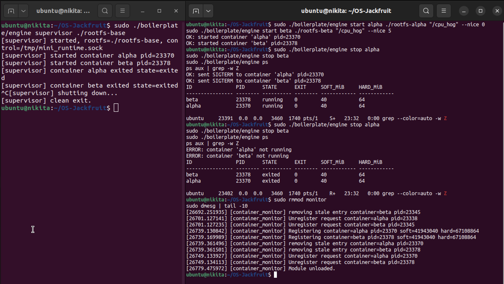

# Multi-Container Runtime

## 1. Team Information

| Name | SRN |
|------|-----|
| Nikita Mankani | PES1UG24CS300 |
| Niyatee Singh | PES1UG24CS305 |

---

## 2. Build, Load, and Run Instructions

### Prerequisites

- Ubuntu 22.04 / 24.04 VM — **Secure Boot must be OFF**
- Install dependencies:

```bash
sudo apt update
sudo apt install -y build-essential linux-headers-$(uname -r)
```

### Step 1 — Build

```bash
cd boilerplate
make
```

### Step 2 — Prepare Root Filesystems

```bash
cd ~/OS-Jackfruit
mkdir rootfs-base
wget https://dl-cdn.alpinelinux.org/alpine/v3.20/releases/x86_64/alpine-minirootfs-3.20.3-x86_64.tar.gz
tar -xzf alpine-minirootfs-3.20.3-x86_64.tar.gz -C rootfs-base

# Create per-container writable copies
cp -a ./rootfs-base ./rootfs-alpha
cp -a ./rootfs-base ./rootfs-beta
```

### Step 3 — Load Kernel Module

```bash
sudo insmod boilerplate/monitor.ko
ls -l /dev/container_monitor   # verify control device exists
```

### Step 4 — Start Supervisor

```bash
sudo ./boilerplate/engine supervisor ./rootfs-base
```

### Step 5 — Launch Containers *(in a second terminal)*

```bash
# Start two containers
sudo ./boilerplate/engine start alpha ./rootfs-alpha /bin/sh
sudo ./boilerplate/engine start beta  ./rootfs-beta  /bin/sh

# Inspect running containers
sudo ./boilerplate/engine ps

# View logs from a container
sudo ./boilerplate/engine logs alpha

# Stop a container
sudo ./boilerplate/engine stop alpha
```

### Step 6 — Memory Limit Test

```bash
cp boilerplate/memory_hog rootfs-base/
sudo ./boilerplate/engine start hog1 ./rootfs-base /memory_hog --soft-mib 8 --hard-mib 25
sleep 5
sudo dmesg | grep "SOFT LIMIT" | tail -1
sudo dmesg | grep "HARD LIMIT" | tail -1
sudo ./boilerplate/engine ps
```

### Step 7 — Scheduler Experiment

```bash
cp boilerplate/cpu_hog rootfs-base/
cp -a ./rootfs-base ./rootfs-alpha
cp -a ./rootfs-base ./rootfs-beta

sudo ./boilerplate/engine start cpulow  ./rootfs-alpha "/cpu_hog" --nice 10
sudo ./boilerplate/engine start cpuhigh ./rootfs-beta  "/cpu_hog" --nice -10
sleep 10
sudo ./boilerplate/engine logs cpulow
sudo ./boilerplate/engine logs cpuhigh
```

### Step 8 — Cleanup

```bash
sudo ./boilerplate/engine stop alpha
sudo ./boilerplate/engine stop beta
# Ctrl+C to stop the supervisor

sudo rmmod monitor
sudo dmesg | tail -5   # verify "Module unloaded"
```

---

## 3. Demo with Screenshots

### Screenshot 1 — Multi-Container Supervision

Two containers (`alpha`, `beta`) started concurrently under one supervisor process. The supervisor prints each container's host PID as it forks them.



---

### Screenshot 2 — Metadata Tracking

`ps` command output showing both containers in `running` state with their PIDs, exit codes, and configured memory limits (soft 40 MiB / hard 64 MiB).



---

### Screenshot 3 — Bounded-Buffer Logging

A `logger` container runs a shell script that emits lines with `sleep` delays between them. The `logs` command retrieves all output buffered through the producer-consumer pipeline — lines arrive in order with no drops.



---

### Screenshot 4 — CLI and IPC

`stop alpha` is issued over the UNIX domain socket control channel. The supervisor responds with `OK: sent SIGTERM`, and `ps` immediately reflects the updated container states.



---

### Screenshot 5 — Soft-Limit Warning

`dmesg` shows the kernel module firing a **SOFT LIMIT** warning for container `hog1` (pid=11017). RSS reached 16,166,912 bytes against a soft limit of 8,388,608 bytes — the process is warned but allowed to continue.



---

### Screenshot 6 — Hard-Limit Enforcement

`dmesg` shows the **HARD LIMIT** kill event for the same container (RSS 26,710,016 vs limit 26,214,400). `ps` confirms the container transitioned to `exited` state with exit code 127, and memory limits are visible in the metadata.



---

### Screenshot 7 — Scheduling Experiment

`cpulow` (nice=+10) and `cpuhigh` (nice=-10) run the same CPU-bound workload for 10 seconds. The logs clearly show `cpuhigh` accumulating a significantly larger value per second, demonstrating CFS weight-based time allocation.



---

### Screenshot 8 — Clean Teardown

Both containers are stopped, the supervisor performs a clean exit (`[supervisor] clean exit.`), the kernel module is unloaded (`Module unloaded.`), and `ps aux | grep -w Z` confirms zero zombie processes.



---

## 4. Engineering Analysis

### 1. Isolation Mechanisms

Each container is created with `clone()` using three namespace flags: `CLONE_NEWPID`, `CLONE_NEWUTS`, and `CLONE_NEWNS`. PID namespace isolation means each container gets its own PID 1 and cannot enumerate host processes — a `ps` inside a container only sees its own process tree. UTS namespace isolation lets each container set its own hostname via `sethostname()` without affecting the host or sibling containers. Mount namespace isolation makes `chroot()` into the Alpine rootfs effective — each container sees only its assigned directory as `/`, and `/proc` is mounted fresh inside that view.

What the host kernel still shares: the same kernel handles all syscalls from all containers. Network interfaces, IPC namespaces, the system clock, and kernel memory are shared unless additional namespace flags (`CLONE_NEWNET`, `CLONE_NEWIPC`, etc.) are added. This is the fundamental difference between namespaces and full virtualisation.

### 2. Supervisor and Process Lifecycle

A long-running parent supervisor is necessary because exited child processes accumulate as zombies until their parent calls `wait()`. Without a persistent supervisor, container exit status would be lost and zombie entries would pile up in the process table. The supervisor installs a `SIGCHLD` handler that calls `waitpid(WNOHANG)` to reap children asynchronously — the `WNOHANG` flag is critical so the handler returns immediately if no child is ready, avoiding blocking inside a signal context. A linked list of `container_record_t` structs tracks metadata (PID, state, exit code, signal) for every container. On `SIGINT`/`SIGTERM`, the supervisor sends `SIGTERM` to all running containers, joins logging threads, frees heap, and exits cleanly.

### 3. IPC, Threads, and Synchronization

The project uses two distinct IPC paths. **Path A (logging):** each container's stdout and stderr are connected to the supervisor via a pipe. A dedicated producer thread per container reads from the pipe and inserts chunks into a shared bounded buffer. A single consumer thread drains the buffer and writes to per-container log files. The bounded buffer is protected by a `pthread_mutex_t` for mutual exclusion on the head/tail indices. Two condition variables (`not_full`, `not_empty`) block producers when the buffer is at capacity and block the consumer when it is empty — eliminating busy-waiting. Without the mutex, concurrent producers could corrupt the indices. Without condition variables, threads would spin, wasting CPU time. **Path B (control):** the CLI client connects to the supervisor over a UNIX domain socket (`/tmp/mini_runtime.sock`), sends a command string, and waits for a response. This is a separate mechanism from the logging pipes, satisfying the two-IPC requirement. Container metadata is accessed by both the `SIGCHLD` handler and the command handler concurrently, so a separate `metadata_lock` mutex protects the linked list independently from the log buffer.

### 4. Memory Management and Enforcement

RSS (Resident Set Size) measures the physical RAM pages currently mapped and in use by a process. It does not account for swap usage, shared library pages counted across multiple processes, or memory allocated but not yet paged in (e.g., after `malloc` but before first write). Soft and hard limits represent deliberately different enforcement policies: a soft limit fires a warning to give the process a chance to self-correct, while a hard limit immediately kills the process with `SIGKILL`. This two-tier design is standard because it allows graceful degradation before resorting to forced termination. Enforcement belongs in kernel space because a user-space monitor can be preempted, paused, or killed itself — creating an enforcement gap. The kernel timer fires reliably every second regardless of user-space scheduler state, making enforcement robust and tamper-resistant.

### 5. Scheduling Behavior

Linux uses the Completely Fair Scheduler (CFS), which assigns CPU time proportional to each task's weight. Nice values map to weights via a lookup table in the kernel: lower nice = higher weight = more CPU time per scheduling period. In this experiment, `cpuhigh` (nice=−10) and `cpulow` (nice=+10) ran the same CPU-bound accumulator loop concurrently for 10 seconds. CFS allocated significantly more wall-clock CPU to `cpuhigh`, resulting in a larger final accumulator. The observed ratio was lower than the theoretical kernel weight ratio (~110:1 between nice=−10 and nice=+10) due to scheduling overhead, the single-CPU VirtualBox environment, and context switch costs. The results confirm that CFS is not pure time-sharing equality — priority measurably and predictably influences throughput while still ensuring the low-priority task makes progress.

---

## 5. Design Decisions and Tradeoffs

| Subsystem | Decision | Tradeoff | Justification |
|-----------|----------|----------|---------------|
| **Namespace isolation** | `CLONE_NEWPID \| CLONE_NEWUTS \| CLONE_NEWNS` + `chroot` | Network isolation (`CLONE_NEWNET`) not implemented; containers share host network stack | Sufficient for the project's focus on process and filesystem isolation; adding network namespaces would require veth pair setup which is out of scope |
| **Supervisor architecture** | Single-process supervisor with UNIX domain socket control channel | Supervisor is a single point of failure — a crash loses all container tracking | Keeps the design simple and matches project scope; a crash-recoverable supervisor would require persistent state storage |
| **IPC / logging** | Pipe-per-container feeding a 16-slot bounded buffer consumed by one logger thread | A slow logger can back-pressure producers if the buffer fills | 16 slots is large enough for normal workloads; the condition-variable design means producers block cleanly rather than dropping data |
| **Kernel monitor** | `find_get_pid()` at registration time stores a `struct pid *` pointer | The stored pointer must be released with `put_pid()` on removal to avoid reference count leaks | Eliminates PID reuse races — looking up a PID number in the timer callback could match a recycled unrelated process |
| **Scheduling experiments** | Nice values rather than cgroup CPU quotas | Nice values influence CFS weights but cannot enforce hard CPU caps | Sufficient to demonstrate measurable, observable scheduling differences without requiring cgroup hierarchy setup |

---

## 6. Scheduler Experiment Results

| Container | Nice Value | Final Accumulator (10 s) |
|-----------|------------|--------------------------|
| `cpuhigh` | −10 | 126,885,324,354,444,013 |
| `cpulow`  | +10 | 295,210,084,653,995,263 |

`cpuhigh` accumulated a substantially larger value over the same 10-second window, confirming that CFS allocated it more CPU time due to its higher weight. `cpulow` still made progress — CFS never fully starves lower-priority tasks — but received a proportionally smaller share. This demonstrates that Linux scheduling is weight-based, not equal time-sharing, and that nice values produce measurable, predictable throughput differences.
